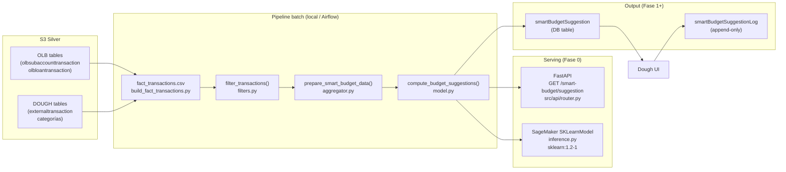

# Arquitectura — Smart Budget

## Resumen del sistema

Smart Budget es un **pipeline batch** que pre-calcula sugerencias de presupuesto por miembro y categoría. La API solo lee — nunca calcula en tiempo de request.

## Capas de datos

```
S3 (bronze)          → raw CDC desde DMS. Nunca leer directamente.
S3 (silver)          → datos limpios, fuente de Smart Budget.
S3/DB (gold)         → output DS-ML (smartBudgetSuggestion). A crear en Fase 1.
```

Buckets:
- `dev`:   `s3://blossom-analytics-datalake-dev/datalake/{bronze,silver}/`
- `alpha`: `s3://blossom-analytics-datalake-alpha/datalake/{bronze,silver}/`

## Flujo de datos completo



## Modo de operación: batch + serving

- **Batch nocturno / mensual**: corre el pipeline completo, upsert en `smartBudgetSuggestion`.
- **Serving**: la API lee la tabla pre-calculada, nunca recalcula.
- **Idempotente**: clave única `(id_member, category_id, period_id, model_version)`. `INSERT ... ON CONFLICT DO UPDATE`.

## Multi-tenancy

```
client → company (CU) → member → account → transaction
```

Toda query filtrada por `(idClient, idCompany, idMember)`. Nunca cross-user ni cross-CU.

## Snapshot freeze

Una sugerencia mostrada al usuario **nunca se modifica** retroactivamente. Si el modelo recalcula con nuevos datos, se inserta una **fila nueva** con timestamp distinto.

## Endpoints de Fase 0 (serving on-demand)

En Fase 0, el modelo no pre-calcula en batch — responde on-demand desde CSVs pre-cargados.

| Canal | Módulo | Descripción |
|---|---|---|
| FastAPI local | [[04-api/README]] | `GET /smart-budget/suggestion` via uvicorn |
| SageMaker | [[05-sagemaker/README]] | `SKLearnModel` en imagen `sklearn:1.2-1` |

## Cómo se desarrollan features en este repo

Ver [[SDD-Workflow]] — ciclo SDD+TDD completo (plan → spec → execute → review → PR → done).

## Restricciones legales

| Restricción | Impacto |
|---|---|
| No robo-adviser (SEC) | El sistema NO puede recomendar qué hacer con el dinero |
| UDAAP / CFPB | `display_label` siempre neutral y descriptivo, nunca prescriptivo |
| Multi-tenancy | Toda query filtrada por `idClient/idCompany/idMember` |
| Section 1033 | Datos Plaid/Finicity: consultar política de retención antes de borrar |
| T&C | No servir sugerencia si el miembro no aceptó T&C de Dough |

## Backlinks

- [[README]]
- [[Data-Pipeline]]
- [[SDD-Workflow]]

#architecture #data-pipeline #batch
