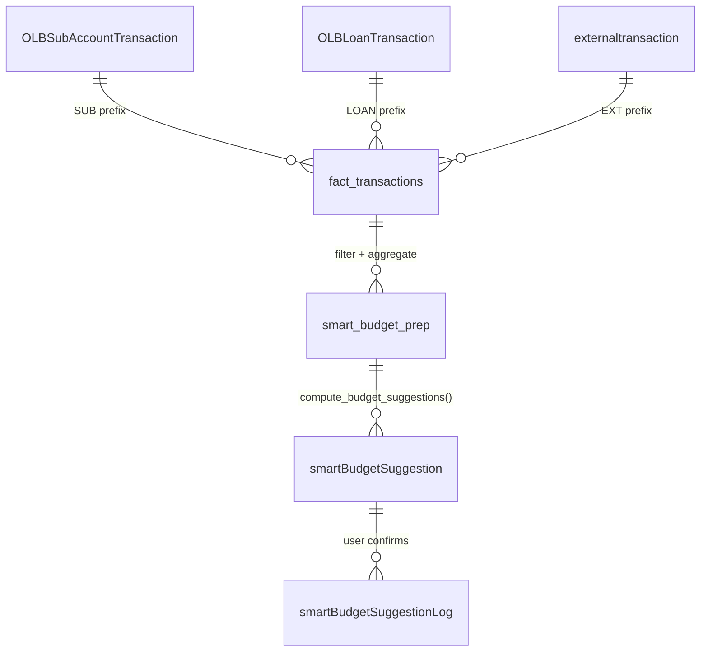

# Data Pipeline — Smart Budget

Concepto transversal que cubre el flujo completo de datos desde S3 hasta el output de sugerencias.

## Fases del pipeline

### Fase 1 — Extracción (scripts/extract_datalake_to_csv.py)

Lee tablas Parquet desde S3 y las escribe como CSV en `data/`.

```bash
# Requiere SSO activo:
aws sso login --profile blossom-dev

# Extraer DOUGH silver (dev):
python3 scripts/extract_datalake_to_csv.py --source DOUGH --layer silver

# Output: data/dough/dev/silver/<tabla>.csv
```

**Origen:** `s3://blossom-analytics-datalake-dev/datalake/{bronze,silver}/`

### Fase 2 — Construcción de fact_transactions (scripts/build_fact_transactions.py)

Construye la tabla central unificando OLB (SUB + LOAN) y Dough (EXT). Las transacciones `LOAN` son excluidas del modelo presupuestal en la etapa de filtrado (Rule 4 en `filters.py`).

```bash
# Modo DB (recomendado — datos idénticos al equipo DE):
python3 scripts/build_fact_transactions.py --source db

# Modo S3 (offline):
python3 scripts/build_fact_transactions.py --source s3 --env dev

# Output: data/dough/fact_transactions.csv (1,413,914 filas, 32 cols)
#         data/dough/fact_transactions_expenditure.csv
#         data/dough/fact_transactions_sample.csv (50k muestra)
```

Ver [[Glossary]] para el schema de 32 columnas.

### Fase 3 — Preparación (scripts/run_smart_budget_prep.py)

Aplica filtros, agrega mensualmente y aplica gating.

```bash
python3 scripts/run_smart_budget_prep.py \
    --input data/dough/fact_transactions.csv \
    --output data/dough/smart_budget_prep.csv \
    --min-months 3
```

Internamente: `filter_transactions()` → `prepare_smart_budget_data()`.

**Output:** `smart_budget_prep.csv` — 504 filas con datos reales (5 cuentas, 11 categorías).

### Fase 4 — Sugerencias (scripts/run_methods.py)

Calcula sugerencias con el método elegido.

```bash
python3 scripts/run_methods.py \
    --method wma \
    --treatment B \
    --reference-date 2026-05 \
    --lookback-months 6 \
    --input data/dough/smart_budget_synthetic.csv \
    --output results.json
```

**Métodos disponibles:** `wma`, `ewma`, `median`, `holt_winters`.
**Treatments:** `A` (incluir ceros), `B` (excluir ceros), `C` (epsilon=0.01).

## Filtros obligatorios

```python
# INCLUIR
estado      == 'Posted'         # Para EXT (Plaid/Finicity)
tipo        == 'expenditure'    # Solo gastos
deletedat   IS NULL             # Soft delete

# EXCLUIR
status      IN ('PENDING', 'HOLD')     # OLB
defaultcategory IN ('UNCATEGORIZED', 'INCOME', 'MONEY_SENT')
defaultcategory IS NULL
```

Ver [[01-core-model/Filters]] para detalles de implementación.

## Diagrama de tablas de entrada



## Tablas de output (a crear en Fase 1)

### smartBudgetSuggestion

```sql
CREATE TABLE smartBudgetSuggestion (
  id                UUID PRIMARY KEY DEFAULT gen_random_uuid(),
  id_client         VARCHAR NOT NULL,
  id_company        VARCHAR NOT NULL,
  id_member         VARCHAR NOT NULL,
  category_id       VARCHAR NOT NULL,
  period_id         VARCHAR NOT NULL,   -- YYYY-MM
  suggested_amount  DECIMAL(12,2),      -- NULL si no hay suficiente data
  months_analyzed   INT,
  data_points       INT,
  period_range      VARCHAR,
  confidence        VARCHAR(10),        -- high | medium | low | null
  display_label     VARCHAR(255),
  model_version     VARCHAR(50) NOT NULL,
  calculated_at     TIMESTAMP DEFAULT NOW(),
  CONSTRAINT uq_suggestion UNIQUE (id_member, category_id, period_id, model_version)
);
```

### smartBudgetSuggestionLog (append-only)

```sql
CREATE TABLE smartBudgetSuggestionLog (
  id                        UUID PRIMARY KEY DEFAULT gen_random_uuid(),
  id_client                 VARCHAR NOT NULL,
  id_company                VARCHAR NOT NULL,
  id_member                 VARCHAR NOT NULL,
  category_id               VARCHAR NOT NULL,
  period_id                 VARCHAR NOT NULL,
  original_suggested_amount DECIMAL(12,2),
  final_user_amount         DECIMAL(12,2),
  accepted_without_change   BOOLEAN,
  ts_presented              TIMESTAMP NOT NULL,
  ts_confirmed              TIMESTAMP,
  model_version             VARCHAR(50) NOT NULL
);
```

## Contrato JSON de output

```json
{
  "category_id": "string",
  "suggested_amount": 420.00,
  "basis": {
    "months_analyzed": 6,
    "months_with_zero": 1,
    "months_with_positive_spend": 5,
    "period_range": "2025-11 ~ 2026-04",
    "method": "wma",
    "treatment": "B"
  },
  "confidence": "medium",
  "display_label": "Basado en tus últimos 6 meses",
  "explanation": "En 5 de tus últimos 6 meses tuviste gastos en esta categoría.",
  "model_version": "fase0-v1"
}
```

## Datos de prueba sintéticos

Para desarrollo/testing sin acceso a S3:

```bash
python3 scripts/generate_synthetic_dataset.py --extend-months 6
# Output: data/dough/smart_budget_synthetic.csv (804 filas, 12 meses, gitignored)
```

## Backlinks

- [[Architecture]]
- [[01-core-model/README]]
- [[02-scripts/README]]

#data-pipeline #etl #fact-transactions
