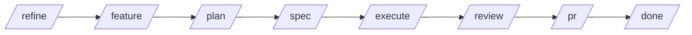

# SDD+TDD Workflow — Smart Budget

Este repo usa el ciclo **SDD+TDD (Solution-Driven Development + Test-Driven Development)** del plugin `blossom-workflow`. Todo cambio de código es trazable a un ticket Jira (`DATA-*`).

## Ciclo completo (8 fases)



| Fase | Comando | Output | Descripción |
|---|---|---|---|
| 0 | `/refine <TICKET>` | `refinement.md` (Jira) | Pre-análisis del ticket: checklist, estimación, riesgos |
| 1 | `/feature <TICKET>` | worktree + Draft PR | Crea el branch `feat/<TICKET>` y el worktree |
| 2 | `/plan <TICKET>` | `changes/<TICKET>/plan.md` + `spec.md` | DCR + HLTC + spec ejecutable |
| 3 | `/execute` | código + tests | TDD: tests primero (RED) → código (GREEN) → refactor |
| 4 | `/review` | `review-report.md` | Auditoría de cumplimiento del spec |
| 5 | `/pr` | PR listo para review | Actualiza PR body, cambia de Draft a Ready |
| 6 | `/done <TICKET>` | archivo en `changes/archive/` | Archiva ciclo, transiciona Jira, rollout flags |

## Artefactos por ciclo

Todos viven en `changes/<TICKET>/`:

```
changes/DATA-1137/
├── plan.md          → DCR (decisiones cerradas) + HLTC
├── spec.md          → spec ejecutable con test contracts
├── preflight.md     → verificación de spec antes de ejecutar
├── threats.md       → análisis de seguridad / compliance
├── review-report.md → resultado de la auditoría post-execute
└── testing-report.md → reporte de tests
```

Cuando el ticket cierra, se archiva en `changes/archive/YYYY-MM-DD-<TICKET>/`.

## Branching

```
feat/<TICKET>   → feature nueva
fix/<TICKET>    → bug fix
```

Desde `main` o `development`. Merge via squash commit al PR.

## Tickets en este repo

| Ticket | Estado | Qué hizo |
|---|---|---|
| DATA-1136 | ✅ Done | Pipeline de preparación: `filter_transactions()`, `aggregate_monthly()`, `apply_gating()`, tests, fixtures |
| DATA-1137 | ✅ Done | Modelo de sugerencias: WMA, EWMA, Median, Holt-Winters, CLI `run_methods.py`, `method_comparison.md` |

## Reglas de Git

- **Branches:** `feat/<TICKET>` — nunca con nombre personal, nunca sin ticket
- **Commits:** `DATA-NNNN: descripción en minúsculas` (≤72 chars)
- **Merge:** squash and merge al PR
- **Protección de `main`/`development`:** todo cambio vía PR, mínimo 1 aprobación

## Backlinks

- [[README]]
- [[Architecture]]

#sdd #tdd #workflow #gitflow
