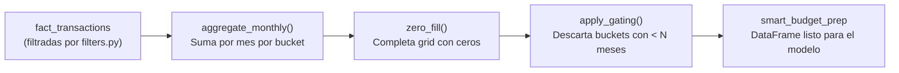

# Aggregator — `src/smart_budget/aggregator.py`

## Propósito

Transforma el dataset de transacciones filtradas en una tabla de montos mensuales por bucket `(member × category)`, lista para ser consumida por el modelo de sugerencias.

## Pipeline de 3 pasos



## `aggregate_monthly(df)`

**Qué hace:** crea `period_yyyymm` desde `date`, agrupa por `(idclient, idcompany, idaccount, idcategory, defaultcategory, period_yyyymm)`, suma `amount`, clampea negativos a 0.

**Por qué clampear a 0:** si en un mes los reembolsos (REF) superan los gastos, la suma neta es negativa. Una sugerencia negativa no tiene sentido — el piso es 0.

```python
agg["monthly_total"] = agg["monthly_total"].clip(lower=0.0)
```

## `zero_fill(df)`

**Qué hace:** genera el grid completo `(member × category) × all_months` en el rango `[min_month, max_month]` del dataset. Para celdas faltantes, `monthly_total = 0`.

**Por qué es importante:** distingue dos tipos de "ausencia":
- **Mes sin cuenta activa**: no incluir (la cuenta no existía aún). Esto se maneja en la Fase de extracción.
- **Mes con cuenta activa pero sin gastos**: incluir como 0. Es un dato real — el miembro no gastó en esa categoría ese mes.

**Validación anti-cross-tenant:**

```python
member_company = df[["idaccount", "idclient", "idcompany"]].drop_duplicates().groupby("idaccount").size()
violations = member_company[member_company > 1]
if not violations.empty:
    raise ValueError("idaccount maps to multiple (idclient, idcompany) pairs")
```

Si un `idaccount` aparece con más de un `(idclient, idcompany)`, hay un bug de multi-tenancy. El error es explícito para no silenciarlo.

## `apply_gating(df, min_months=3)`

**Qué hace:** descarta buckets donde el número de meses con `monthly_total > 0` es menor a `min_months`.

**Regla clave:** los meses zero-filled (value=0) **NO** cuentan hacia el threshold. Si un bucket tiene 4 meses pero 3 son ceros, solo tiene 1 mes real → excluido (con `min_months=2`).

```python
nonzero = df[df["monthly_total"] > 0]
month_counts = nonzero.groupby(["idaccount", "idcategory", "defaultcategory"])["period_yyyymm"].nunique()
qualifying = month_counts[month_counts["month_count"] >= min_months]
```

**Default `min_months=3`:** configurable por CU. La lógica del spec de Fase 0 originalmente usaba 2, luego se ajustó a 3 para aumentar la confiabilidad de la sugerencia.

## `prepare_smart_budget_data(df, min_months=3)`

Orquesta el pipeline completo. Es el punto de entrada cuando se usa desde el CLI.

**Output garantizado:**

```
columnas: [idclient, idcompany, idaccount, idcategory, defaultcategory, period_yyyymm, monthly_total]
monthly_total: float, >= 0
todos los buckets tienen >= min_months meses con monthly_total > 0
```

## Tests

```bash
pytest tests/unit/test_aggregator.py -v
# 7 tests: TC-3.1 a TC-3.7 (incluyendo idempotency test)
```

## Backlinks

- [[01-core-model/README]]
- [[01-core-model/Public-API]]
- [[01-core-model/Model]]

#aggregator #core-model #pipeline
