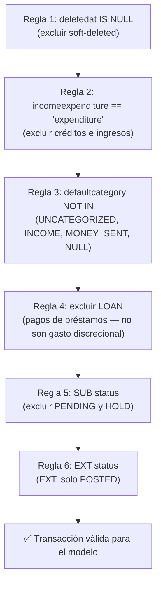

# Filters — `src/smart_budget/filters.py`

**Único punto de entrada:** `filter_transactions(df)`.

## Propósito

Aplica las 6 reglas de filtrado **no negociables** sobre `fact_transactions` para garantizar que solo ingresen al modelo transacciones válidas, completadas y presupuestables.

## Las 6 reglas (en orden de aplicación)



### Regla 1 — Soft delete (A2)

```python
df = df[df["deletedat"].isna()]
```

Excluye registros eliminados lógicamente. La columna `deletedat` es un timestamp; `NULL` significa activo.

### Regla 2 — Solo gastos / excluir créditos (A3)

```python
df = df[df["incomeexpenditure"] == "expenditure"]
```

Excluye ingresos y créditos. Smart Budget solo presupuesta gastos discrecionales.

### Regla 3 — Categorías válidas (A4)

```python
EXCLUDED_CATEGORIES = {"UNCATEGORIZED", "INCOME", "MONEY_SENT"}
df = df[df["defaultcategory"].notna()]
df = df[~df["defaultcategory"].isin(EXCLUDED_CATEGORIES)]
```

- `UNCATEGORIZED`: la transacción no tiene categoría asignada aún.
- `INCOME`: categoría de ingreso (redundante con Regla 2, pero defensivo).
- `MONEY_SENT`: label legacy OLB para Internal Transfers (Grupo 3 del catálogo = Excluded). No es gasto discrecional presupuestable.

### Regla 4 — Excluir LOAN (pagos de préstamos)

```python
df = df[~df["idtransaction"].str.startswith("LOAN")]
```

Los pagos de préstamos (prefijo `LOAN`) son obligaciones financieras fijas, no gasto discrecional. Incluirlos distorsionaría las sugerencias de presupuesto en categorías como Auto & Transport o Groceries.

> **Nota sobre signo:** el core OLB almacena débitos como negativos (`amount < 0`). `build_fact_transactions.py` aplica `abs()` al construir `fact_transactions` para normalizar a positivo, igual que EXT (Plaid). El clamp en `aggregator.py` actúa como safety net adicional.

### Regla 5 — SUB (OLB SubAccount) status (A5)

```python
is_sub = df["idtransaction"].str.startswith("SUB")
sub_invalid = is_sub & df["status"].notna() & df["status"].str.upper().isin(["PENDING", "HOLD"])
df = df[~sub_invalid]
```

Para transacciones OLB SubAccount: excluir si `status IN ('PENDING', 'HOLD')`. Status `NULL` y `CLEARED` pasan.

### Regla 6 — EXT (Plaid/Finicity) status (A6)

```python
is_ext = df["idtransaction"].str.startswith("EXT")
ext_invalid = is_ext & (df["status"].str.upper() != "POSTED")
df = df[~ext_invalid]
```

Para transacciones externas Dough: solo `POSTED`. Cualquier otro status (incluyendo `NULL`) se excluye.

### Prefijos desconocidos

Los prefijos que no son `SUB` ni `EXT` **pasan sin filtro de status**. `LOAN` es excluido en Regla 4 antes de llegar aquí. Diseño intencional para evitar data loss silencioso con prefijos futuros.

## Casos edge cubiertos

| Caso | Comportamiento |
|---|---|
| DataFrame vacío | Retorna DataFrame vacío con índice reseteado |
| `deletedat` con string vacío (`""`) | Convertir a `None` antes de llamar la función |
| `status` con string vacío | Convertir a `None` antes de llamar la función |
| `MONEY_SENT` con type `expenditure` | Excluido por Regla 3 |
| OLB con `status=None` | Pasa (solo se excluye si status es explícitamente PENDING/HOLD) |

## TODO pendiente (Fase de producción)

```python
# TODO(prod): add T&C gate (membertacacceptance) before processing — deferred for dev/alpha
```

Antes de producción: verificar que el miembro aceptó los T&C de Dough. Actualmente comentado en el archivo.

## Tests

```bash
pytest tests/unit/test_filters.py -v
# 10 tests: TC-2.1 a TC-2.8 + edge cases
```

## Backlinks

- [[01-core-model/README]]
- [[01-core-model/Public-API]]

#filters #core-model #business-rules
