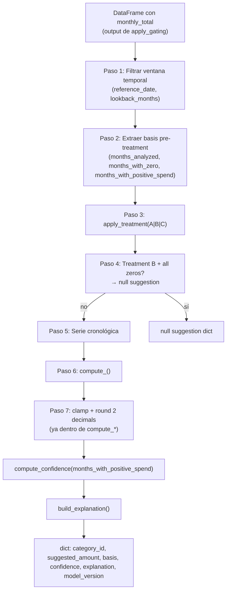

# Model — `src/smart_budget/model.py`

## Propósito

Módulo de sugerencia de presupuesto. Toma el output de [[01-core-model/Aggregator]] y produce una sugerencia de monto por bucket usando el método elegido.

## Los 4 métodos

| Método | Función | Fortaleza | Debilidad |
|---|---|---|---|
| **WMA** | `compute_wma()` | Simple, predecible, meses recientes pesan más | No modela estacionalidad |
| **EWMA** | `compute_ewma(span=3)` | Reactividad ajustable vía `span` | Parámetro sensible |
| **Median** | `compute_median()` | Robusto a outliers, bueno para categorías estacionales | No captura tendencias |
| **Holt-Winters** | `compute_holt_winters()` | Modela tendencia explícita | Requiere ≥3 obs, inestable con pocos datos |

**Recomendación para Fase 0:** WMA + Treatment B + lookback=6 (balance coverage/estabilidad). Para categorías estacionales (Travel, Gifts): Median + Treatment B + lookback=12.

## Los 3 treatments de ceros

| Treatment | Código | Descripción | Cuándo usar |
|---|---|---|---|
| A | `include_zeros` | Sin cambio — zeros incluidos | Quiero ver el gasto promedio incluyendo meses inactivos |
| B | `exclude_zeros` | Filtra meses con `monthly_total == 0` | Quiero la media de meses *donde el usuario efectivamente gastó* |
| C | `epsilon_replace` | Reemplaza 0 por 0.01 | Evita divisiones por cero en métodos que las necesitan |

## Pipeline de `compute_budget_suggestions()`



## Reglas de negocio del modelo

### Ventana temporal

```python
ref_period = pd.Period(reference_date, freq="M")
# El mes de reference_date ES incluido (<= es intencional)
df = df[df["_period"] <= ref_period]
if lookback_months is not None:
    start_period = ref_period - lookback_months + 1
    df = df[df["_period"] >= start_period]
```

Con `lookback_months=3` y `reference_date="2026-05"`, se usan: `2026-03`, `2026-04`, `2026-05`.

### Confidence (PRE-treatment)

La confidence se calcula sobre los datos **antes** del treatment — refleja cuántos meses reales el usuario gastó en esa categoría:

```python
months_with_positive_spend = int((df_bucket["monthly_total"] > 0.0).sum())
confidence = compute_confidence(months_with_positive_spend)
# high: >= 6 | medium: 3-5 | low: 2
```

### UDAAP compliance en `build_explanation()`

- ✅ `"En 5 de tus últimos 6 meses tuviste gastos en esta categoría."`
- ❌ `"Deberías gastar menos en X"` — PROHIBIDO
- ❌ `"Gastas más que el promedio"` — PROHIBIDO

### Null suggestion

Cuando no hay sugerencia (Treatment B + todo ceros, o HW con < 3 obs):

```json
{
  "category_id": "string",
  "suggested_amount": null,
  "basis": null,
  "confidence": null,
  "display_label": "No hay suficiente historial para esta categoría",
  "explanation": "No hay datos históricos suficientes para calcular una sugerencia en esta categoría.",
  "model_version": "fase0-v1"
}
```

## Resultados del análisis (dataset 12 meses)

Ver `docs/method_comparison.md` para el análisis completo.

**Resumen por ventana:**
- lb=3: WMA-B (0 nulls), HW-B (20 nulls — no recomendado)
- lb=6: WMA-B = Median-B (idénticos con Treatment B en datos estacionales)
- lb=9/12: Idénticos a lb=6 con Treatment B (mismos meses positivos disponibles)

## Constantes

```python
EPSILON_DEFAULT: float = 0.01   # Treatment C
EWMA_SPAN_DEFAULT: int = 3      # EWMA default span
_MODEL_VERSION = "fase0-v1"     # Identificador del modelo
```

## Tests

```bash
pytest tests/unit/test_model.py -v
# 38 tests: WMA/EWMA/HW/Median, treatments, gating, UDAAP, golden set regression
```

## Backlinks

- [[01-core-model/README]]
- [[01-core-model/Public-API]]
- [[01-core-model/Aggregator]]
- [[Data-Pipeline]]

#model #wma #ewma #median #holt-winters #core-model
