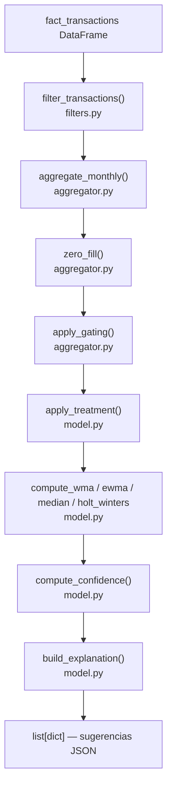

# Core Model — `src/smart_budget/`

**Path:** `src/smart_budget/`
**Maintainers:** DS-ML team (DATA tickets)

## Propósito

Módulo central de Smart Budget. Contiene toda la lógica de negocio: filtrado de transacciones, agregación mensual, gating de cobertura y cálculo de sugerencias con múltiples métodos estadísticos.

## Estructura interna

```
src/smart_budget/
├── __init__.py       → módulo vacío (importabilidad)
├── filters.py        → filter_transactions() — 6 reglas de filtrado
├── aggregator.py     → aggregate_monthly(), zero_fill(), apply_gating(),
│                       prepare_smart_budget_data()
└── model.py          → apply_treatment(), compute_wma(), compute_ewma(),
                        compute_median(), compute_holt_winters(),
                        compute_budget_suggestions()
```

## Public surface

Ver [[01-core-model/Public-API]] para la lista completa de funciones.

Las funciones de entrada del pipeline son:

| Función | Archivo | Descripción |
|---|---|---|
| `filter_transactions(df)` | `filters.py` | Aplica 6 reglas de filtrado sobre `fact_transactions` |
| `prepare_smart_budget_data(df, min_months)` | `aggregator.py` | Orquesta filter → aggregate → zero_fill → gating |
| `compute_budget_suggestions(df, method, treatment, reference_date, ...)` | `model.py` | Pipeline principal: 1 dict por bucket con sugerencia o null |

## Arquitectura interna



## Patrones

- **Pipeline funcional**: cada función recibe y devuelve un DataFrame. Sin estado global.
- **Inmutabilidad**: todas las funciones hacen `df.copy()` antes de modificar.
- **Fail-fast**: excepciones explícitas con mensajes claros (no silenciar errores).
- **Clamp a 0**: nunca retornar montos negativos (REF > gasto → 0).
- **Idempotente**: el pipeline produce el mismo output si se corre N veces con el mismo input.

## Reglas de negocio críticas

Ver [[01-core-model/Filters]] para las 6 reglas de filtrado.

- **Gating**: bucket con < `min_months` meses de datos positivos → null suggestion (no sugerir).
- **Snapshot freeze**: una sugerencia emitida nunca se modifica retroactivamente.
- **Multi-tenancy**: toda query filtrada por `(idclient, idcompany, idaccount)`.
- **UDAAP compliance**: `display_label` y `explanation` nunca prescriptivos.
- **Moneda**: USD asumido. Si llega otra moneda → log warning + skip (Fase 0).

## Sub-features

- [[01-core-model/Filters]] — reglas de filtrado (6 reglas, Posted, Expenditure, LOAN exclusion, etc.)
- [[01-core-model/Aggregator]] — agregación mensual, zero-fill, gating
- [[01-core-model/Model]] — métodos WMA / EWMA / Median / Holt-Winters + pipeline

## Dependencias

**Internas:** ninguna (módulo raíz)
**Externas:** `pandas`, `statsmodels` (solo para Holt-Winters)

## Tests

```bash
# Todos los tests del módulo:
pytest tests/unit/test_filters.py tests/unit/test_aggregator.py tests/unit/test_model.py -v

# Con cobertura:
pytest tests/ --cov=src/smart_budget --cov-report=term-missing
# Cobertura actual: 93%
```

Tests: 57 total (19 en filters, 7 en aggregator, 38 en model — incluyendo golden set regression).

## Related concepts

- [[Data-Pipeline]] — cómo este módulo encaja en el flujo completo
- [[Glossary]] — definiciones de bucket, gating, treatment, etc.

## Backlinks

- [[README]]
- [[02-scripts/README]]
- [[03-tests/README]]
- [[Data-Pipeline]]

#core-model #module #pipeline #filters #aggregator
