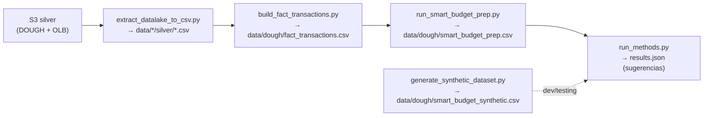

# Scripts ETL & CLI — `scripts/`

**Path:** `scripts/`
**Maintainers:** DS-ML team

## Propósito

Scripts de extracción de datos desde S3, construcción de `fact_transactions`, preparación del dataset para el modelo y CLI de métodos de sugerencia. Son los "jobs" del pipeline batch.

## Archivos

```
scripts/
├── extract_datalake_to_csv.py      → Descarga tablas Parquet de S3 → CSV local
├── build_fact_transactions.py      → Construye fact_transactions (OLB + DOUGH)  [LEGACY]
├── run_smart_budget_prep.py        → Pipeline filter → aggregate → gating → CSV
├── run_methods.py                  → CLI para calcular sugerencias por método
└── generate_synthetic_dataset.py   → Genera dataset sintético para tests/dev
```

> **LEGACY (post-DATA-1275):** `extract_smart_budget_monthly.py` y `build_fact_transactions.py --source db`
> están deprecados tras la migración a Athena/Glue. El endpoint ahora consulta
> `dlh_gold_dough_dev.smart_budget_transactions` directamente via pyathena.
> Ver nuevo módulo: [[01-core-model/athena_loader]] → `src/smart_budget/athena_loader.py`

## Flujo de datos entre scripts



## Sub-features

- [[02-scripts/Public-API]] — CLI flags de cada script

## Dependencias

**Internas:** `smart_budget.filters`, `smart_budget.aggregator`, `smart_budget.model`
**Externas:** `pandas`, `boto3`, `pyarrow`, `structlog`, `statsmodels`

## Convenciones

- Logs con `structlog` (nunca `print`)
- Escritura atómica: `tmp_path` → `os.replace()` → `os.chmod(0o600)`
- Nunca loguear montos individuales ni member IDs sin hashear
- Sanitización de errores: el logger de error nunca incluye contenido del DataFrame

## Backlinks

- [[README]]
- [[01-core-model/README]]
- [[Data-Pipeline]]

#scripts #etl #cli #module
