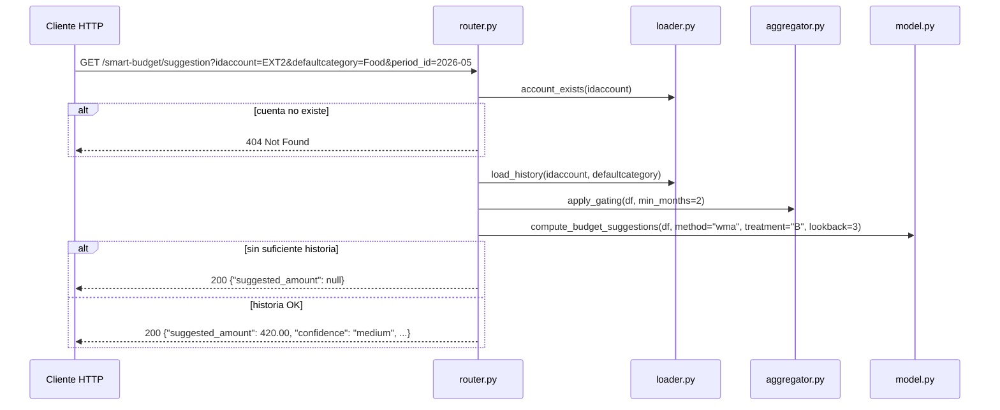

# API — `src/api/`

**Path:** `src/api/`
**Maintainers:** DS-ML team (DATA tickets)

## Propósito

Expone el endpoint REST `GET /smart-budget/suggestion` para que BlossomAPI devuelva sugerencias de presupuesto por cuenta y categoría, orquestando el pipeline de carga → gating → modelo.

## Estructura interna

```
src/api/
├── __init__.py   → marker de paquete (vacío)
└── router.py     → toda la lógica: definición de ruta, validación, pipeline, serialización
src/main.py       → entrada FastAPI — monta el router bajo /smart-budget
```

## Public surface

Ver [[04-api/Public-API]] para el contrato completo.

| Símbolo | Tipo | Descripción |
|---|---|---|
| `GET /smart-budget/suggestion` | Route | Devuelve sugerencia por `idaccount + defaultcategory + period_id` |
| `SuggestionResponse` | Pydantic model | Schema de respuesta (incluye `amount_by_month`) |
| `BasisDetail` | Pydantic model | Sub-schema con metadata del cálculo |
| `IdAccount`, `Category`, `PeriodId` | Enum | Validación de parámetros — FastAPI rechaza valores inválidos con 422 |

## Arquitectura



## Patrones

- **Orchestrator/pipeline**: router delega a tres módulos domain (loader → aggregator → model) en pipeline secuencial.
- **Enum-gated validation**: los tres query params son `str, Enum` — FastAPI rechaza valores desconocidos con `422` antes de correr lógica de negocio.
- **Structured logging**: cada paso emite eventos con `structlog` (`smart_budget.suggestion.start`, `.done`, `.null`).
- **Environment-driven config**: `SMART_BUDGET_DATA_DIR` configura el directorio de datos con fallback a `data/dough/`.

## Reglas de negocio

- **Reference date offset**: `reference_date = period_id − 1 mes` — la ventana de historia usa los meses *previos* al período target (decisión DATA-1138).
- **Gating rule**: ≥ 2 meses con gasto positivo requeridos; de lo contrario devuelve `200 null` (no error).
- **Treatment B / all-zeros**: si el modelo retorna `suggested_amount=None` (gasto cero en ventana bajo Treatment B), la API devuelve `null` en lugar de `0`.
- **404 vs 200-null**: cuenta desconocida → `404`; cuenta conocida sin data suficiente → `200 null`.
- **Config fija**: `method=wma`, `treatment=B`, `lookback=3`, `min_months_gating=2` son constantes (no feature flags en Fase 0).

## Dependencias

**Internas:** [[01-core-model/README]] — `smart_budget.aggregator`, `smart_budget.loader`, `smart_budget.model`
**Externas:** `fastapi`, `pydantic`, `pandas`, `structlog`

## Tests

```bash
pytest tests/unit/test_api.py -v
# 10 tests: TC-T2.1–T2.10
# Cubre: happy path, 404, 422 (bad category, bad period format), 200-null variants
```

## Sub-features

- [[04-api/Public-API]] — contrato completo del endpoint

## Related concepts

- [[Architecture]] — cómo este módulo encaja en el flujo batch + serving
- [[05-sagemaker/README]] — equivalente SageMaker del mismo pipeline
- [[Glossary]] — reference_date, gating, treatment

## Backlinks

- [[README]]
- [[Architecture]]
- [[05-sagemaker/README]]

#api #fastapi #rest #module
