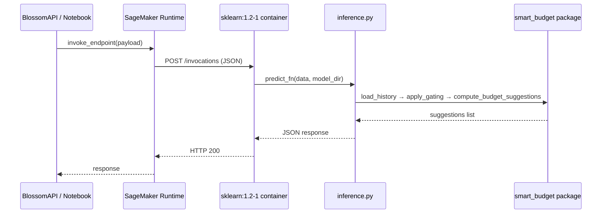

# SageMaker Inference — `src/sagemaker/`

**Path:** `src/sagemaker/`
**Maintainers:** DS-ML team (DATA tickets)

## Propósito

Script de inferencia para AWS SageMaker que expone el mismo pipeline WMA a través del protocolo `SKLearnModel` (imagen `sklearn:1.2-1`), permitiendo invocar el modelo desde BlossomAPI sin levantar FastAPI.

## Estructura interna

```
src/sagemaker/
├── __init__.py        → marker de paquete (vacío)
├── inference.py       → 4 funciones del contrato SageMaker: model_fn, input_fn, predict_fn, output_fn
└── requirements.txt   → pins de dependencias para el contenedor
```

## Public surface

Ver [[05-sagemaker/Public-API]] para la firma completa.

| Función | Descripción |
|---|---|
| `model_fn(model_dir)` | Carga el artifact directory y parchea `sys.path` |
| `input_fn(input_data, content_type)` | Deserializa JSON, valida `defaultcategory` |
| `predict_fn(data, model)` | Corre pipeline WMA completo, enforces reglas de negocio |
| `output_fn(prediction, accept)` | Serializa resultado a JSON string |

## Arquitectura



## Patrones

- **SageMaker SKLearnModel handler protocol** — sigue estrictamente el contrato de 4 funciones.
- **Lazy imports** dentro de `predict_fn` para evitar fallos en import-time en el contenedor.
- **LRU cache clearing** (`_synthetic_accounts.cache_clear()`) por invocación para inferencia stateless.
- **Athena-based data loading**: los datos se consultan en tiempo de inferencia desde `dlh_gold_dough_dev.smart_budget_transactions` via `smart_budget.athena_loader` — ya no se empaquetan CSVs en `model.tar.gz`.

## Estructura del model.tar.gz

Los datos ya **no** se incluyen en el tarball. La inferencia los consulta en tiempo real desde Athena.

```
model.tar.gz
└── smart_budget/                    → paquete Python empaquetado
    ├── __init__.py
    ├── aggregator.py
    ├── athena_loader.py             → NEW: load_history_by_member_athena, member_exists_athena
    ├── filters.py
    ├── loader.py
    └── model.py
```

### Variables de entorno requeridas en el endpoint SageMaker

| Variable | Descripción |
|---|---|
| `ATHENA_S3_STAGING_DIR` | Bucket S3 para resultados de Athena (ej: `s3://blossom-analytics-safe-dev-nv/athena-results/`) |
| `ATHENA_REGION_NAME` | Región AWS (ej: `us-east-1`) |
| `ATHENA_DATABASE` | Base de datos Athena (ej: `dlh_gold_dough_dev`) |
| `ATHENA_TABLE` | Tabla Athena (ej: `smart_budget_transactions`) |

## Reglas de negocio

- **Rule 1**: `idaccount` desconocido → `ValueError` (→ HTTP 400 desde SageMaker)
- **Rule 2**: `category_id` inválido (no encontrado en Athena) → `ValueError` en `input_fn`
- **Rule 3**: cuenta existe pero historia insuficiente (< 2 meses) → retorna `null` suggestion, nunca error
- **Config fija**: `method=wma`, `treatment=B`, `lookback=3`, `min_months_gating=2`, `model_version="fase0-v1"`

## Compatibilidad de imagen

| Imagen SageMaker | Python | numpy | pandas | Compatibilidad |
|---|---|---|---|---|
| `sklearn:1.2-1` | 3.9 | 1.23.5 | 1.5.3 | ✅ Compatible |
| `sagemaker-distribution:3.8.5` | 3.10 | 1.24.x | 2.x | ⚠️ Requiere `sagemaker-core` reinstall |
| `sagemaker-distribution:4.x` | 3.10 | 2.x | 2.x | ❌ ABI conflict con statsmodels |

## Restricción de statsmodels

`statsmodels` **no puede instalarse** en `sklearn:1.2-1` por conflicto ABI con numpy 1.23.5. El import `from statsmodels.tsa.holtwinters import ExponentialSmoothing` es **lazy** dentro de `compute_holt_winters()` en `model.py` — nunca se ejecuta cuando `method="wma"`.

## Dependencias

**Internas:** [[01-core-model/README]] — `smart_budget.aggregator`, `smart_budget.model`; `smart_budget.athena_loader` — `load_history_by_member_athena`, `member_exists_athena`
**Externas (pinned):** `numpy==1.23.5`, `pandas==1.5.3`, `structlog>=21.0.0`

## Tests

```bash
pytest tests/unit/test_inference.py -v
# 6 tests: TC-T5.1–T5.6
# Cubre: model_fn, input_fn, predict_fn (hit + miss), output_fn, null response
```

## Deploy

Ver guía: [[../guides/smart-budget/How-To-Use-Endpoint]] y notebook `notebooks/smart_budget_sagemaker_endpoint.ipynb`.

```python
# Upload model tarball
s3_uri = "s3://blossom-analytics-safe-dev-nv/smart_budget/endpoint/v1/model.tar.gz"

# Deploy
from sagemaker.sklearn import SKLearnModel
model = SKLearnModel(
    model_data=s3_uri,
    role=role,
    entry_point="inference.py",
    source_dir=str(REPO_ROOT / "src" / "sagemaker"),
    framework_version="1.2-1",
    py_version="py3",
)
predictor = model.deploy(initial_instance_count=1, instance_type="ml.m5.large")
```

## Sub-features

- [[05-sagemaker/Public-API]] — contrato de las 4 funciones handler

## Related concepts

- [[04-api/README]] — equivalente FastAPI del mismo pipeline
- [[Architecture]] — cómo SageMaker encaja en el flujo completo
- [[Glossary]] — SKLearnModel, model.tar.gz, inference script

## Backlinks

- [[README]]
- [[Architecture]]
- [[04-api/README]]

#sagemaker #inference #aws #module
