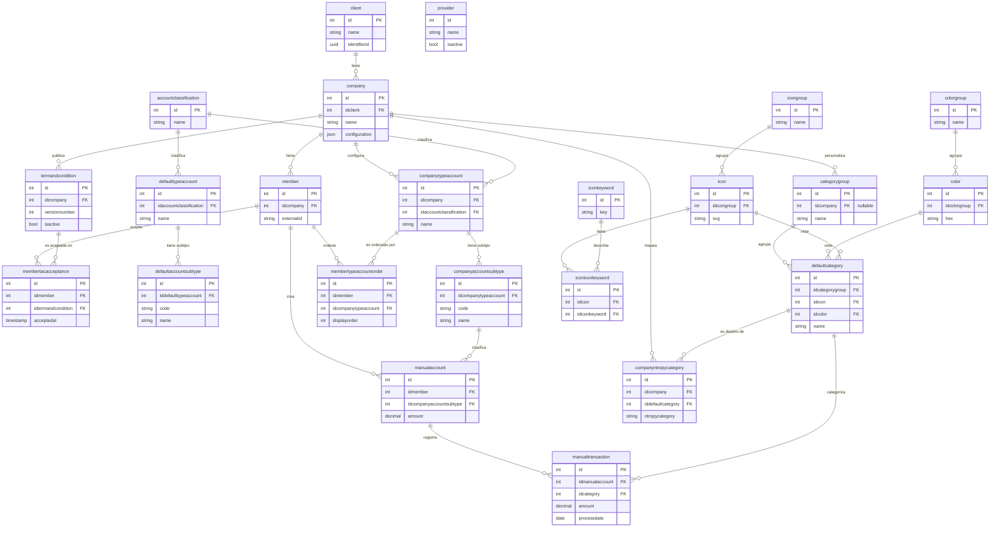

# Revisión de datos — `data/dough/`

**Fecha:** 2026-05-08
**Autor:** Landneyker (DS-ML)
**Alcance:** Revisión del dataset de Dough disponible en el repositorio para implementación de Smart Budget Fase 0.

---

## 0. Origen del snapshot y entornos

### Fuente exacta

El snapshot se extrae con el script `scripts/extract_dough_to_csv.py`. Las constantes del script declaran:

```python
BUCKET        = "blossom-analytics-datalake-alpha"
LAYERS        = ["bronze", "silver"]
DOUGH_PREFIX  = "datalake/{layer}/DOUGH/"
PROFILE       = "blossom-dev"
SKIP_TABLES   = {"_bronze_watermark", "_silver_watermark", "logs", "migrations", "seeder_tracking"}
```

Los datos provienen del data lake **alpha** en S3, accedidos con perfil de desarrollo. No es producción.

### Confirmación por configuración interna

Las tablas `client.csv` y `company.csv` contienen URLs que confirman el entorno:

| Componente | URL | Entorno |
|---|---|---|
| OLB API | `https://blossom-olb-api-alpha.blossomalpha.com` | alpha |
| Viewer (Clarity) | `https://viewer.clarity.blossombeta.com` | beta |
| Viewer (Wasatch) | `https://viewer.wp.blossombeta.com` | beta |
| Assets (dev) | `https://devolbassets.static-content.blossomdev.com` | dev |
| Assets (prod) | `https://prodolbassets.static-content.blossom.net` | prod (solo logos) |

### Mapa de entornos y dónde vivirían las tablas

| Sistema | Ubicación | Estado actual | Notas |
|---|---|---|---|
| Datalake **alpha** | `s3://blossom-analytics-datalake-alpha/datalake/{bronze,silver}/DOUGH/` | ✅ Conocido. Solo catálogos. | Lo que se ve en este repo. |
| Datalake **prod** | `s3://blossom-analytics-datalake-prod/datalake/...` (nombre tentativo) | ⚠️ Por confirmar | Probable destino real de Smart Budget en producción. |
| BD operativa Dough alpha | RDS / Aurora (nombre tentativo: `dough-alpha-db` o equivalente del OLB alpha) | ⚠️ Por confirmar | Schema completo está en `base-de-datos-modelo.pdf`; bajo volumen. |
| BD operativa Dough prod | Postgres operativa (`blossom-prod` o instancia dedicada) | ⚠️ Por confirmar | Donde sí hay tráfico real con transacciones de miembros. |

> Cualquier nombre marcado como tentativo debe ser confirmado con Data Engineering antes de codear contra él.

### Volumen del entorno alpha (orden de magnitud)

- 1 client (Blossom)
- 2 companies (Clarity CU, Wasatch Peaks CU)
- 14 members
- 1 manualaccount, 1 manualtransaction
- 0 transacciones reales de Plaid/Finicity en el snapshot

> El volumen es coherente con un entorno de pruebas seedeado, no con tráfico productivo.

---

## 1. Diferencias entre capas (bronze · silver · gold)

| Capa | Estado | Filas vs. silver | Columnas vs. silver | Qué contiene |
|---|---|---|---|---|
| **bronze** | Activa (23 tablas) | Iguales en 22/23 tablas; 1 tabla con más filas | **+5 columnas** en todas: `_dms_operation`, `_dms_timestamp`, `_ingested_at`, `_run_id`, `_load_type` | Stream CDC crudo desde AWS DMS (Database Migration Service). Incluye eventos `insert`/`delete` y metadata de la corrida de extracción. |
| **silver** | Activa (23 tablas) | Estado actual reconciliado | Solo columnas de negocio | Datos ya limpios, sin metadata de extracción. Es la capa lista para análisis. |
| **gold** | **Vacía** (0 archivos) | — | — | Carpeta creada pero sin contenido. No existen agregados ni vistas curadas todavía. |

### Hallazgos clave

1. **Bronze ≈ Silver en contenido.** La diferencia entre ambas capas es estructural, no semántica:
   - Bronze añade **5 columnas** consistentes en las 23 tablas: metadata del proceso de DMS (operación CDC, timestamp DMS, timestamp de ingesta, run_id, load_type).
   - Silver elimina esas columnas y conserva solo los campos de negocio.
2. **Una sola tabla difiere en filas:** `membertypeaccountorder` (bronze: 46 → silver: 28). Bronze conserva los eventos `delete` del CDC; silver aplica la operación y mantiene el estado vigente. Esto confirma que silver es una capa **upsert/dedup** sobre bronze.
3. **Algunas tablas silver retienen `_last_cdc_timestamp`** (`member`, `membertacacceptance`, `membertypeaccountorder`, `termandcondition`). Es una decisión razonable para auditoría/reconciliación; el resto de tablas no la conserva.
4. **Gold está vacía.** No hay agregados, marts ni vistas dimensionales aún. Smart Budget tendría que construir su propio agregado (`member × category × month`) en gold como nuevo modelo dbt.

### Conclusión sobre la elección de capa

> **Silver es la fuente correcta para el análisis y la implementación de Smart Budget Fase 0.**
> Bronze añade ruido (metadata de DMS) sin valor para el modelo, y gold no existe todavía.
> Los pipelines de Smart Budget deben **leer de silver** y **materializar en gold** sus salidas.

---

## 2. Diccionario de tablas — capa Silver

> 23 tablas agrupadas por dominio funcional. Cada bloque incluye el propósito, las columnas relevantes y observaciones para Smart Budget.

### 2.1 Multi-tenancy y miembros (5 tablas)

#### `client`
**Propósito:** tenant raíz del SaaS (Blossom es el único cliente).
**Filas:** 1 · **Columnas:** `id`, `name`, `identifierid` (UUID), `configuration` (JSON con host, protocolo, websockets), `webhookapikeyhash`, `webhookapikeysalt`, `createdat`, `updatedat`, `deletedat`, `webhookapikeyupdatedat`.
**Para Smart Budget:** todos los joins deben filtrar por `id_client` aunque haya un solo client hoy.

#### `company`
**Propósito:** Credit Unions (CUs) que contratan Dough.
**Filas:** 2 (Clarity CU, Wasatch Peaks CU).
**Columnas:** `id`, `idclient`, `name`, `code`, `externalid`, `configuration` (JSON con tema, logo, time zone, viewer URL), timestamps.
**Para Smart Budget:** el `configuration.timeZone` es importante para definir las fronteras de mes (Clarity = `America/New_York`, Wasatch = `America/Denver`). **Confirmar política**: ¿usamos UTC o el TZ de la CU?

#### `member`
**Propósito:** miembros (usuarios finales) de cada CU.
**Filas:** 14 · **Columnas:** `id`, `idcompany`, `externalid`, timestamps, `_last_cdc_timestamp`.
**Para Smart Budget:** la unidad mínima de cálculo. Toda sugerencia se calcula por `id` de member.

#### `termandcondition`
**Propósito:** versiones de T&C que cada CU expone a sus miembros.
**Filas:** 3 · **Columnas:** `id`, `idcompany`, `externalid`, `condition`, `name`, `description`, `language`, `versionnumber`, `isrequired`, `isactive`, timestamps.
**Para Smart Budget:** condición previa para servir sugerencia. Si el miembro no tiene una aceptación válida → no exponer.

#### `membertacacceptance`
**Propósito:** registro inmutable de qué miembro aceptó qué T&C y cuándo.
**Filas:** 16 · **Columnas:** `id`, `idmember`, `idtermandcondition`, `acceptedat`, timestamps, `_last_cdc_timestamp`.
**Para Smart Budget:** validar que existe una fila activa antes de servir sugerencia.

---

### 2.2 Providers externos (1 tabla)

#### `provider`
**Propósito:** catálogo de agregadores de cuentas externas.
**Filas:** 2 (FINICITY activo, PLAID inactivo) · **Columnas:** `id`, `name`, `isactive`, `configuration`, timestamps.
**Para Smart Budget:** define qué fuentes alimentan el histórico. Hoy solo Finicity está activo.

---

### 2.3 Taxonomía de cuentas — catálogo global (3 tablas)

#### `accountclassification`
**Propósito:** clasificación de máximo nivel.
**Filas:** 3 (Assets, Liabilities, Other) · **Columnas:** `id`, `name`, timestamps.

#### `defaulttypeaccount`
**Propósito:** tipos de cuenta globales definidos por Blossom (Cash, Investments, etc.).
**Filas:** 9 · **Columnas:** `id`, `idaccountclassification`, `name`, `description`, `icon`, `shouldshowinmenu`, `displayorder`, timestamps.

#### `defaultaccountsubtype`
**Propósito:** subtipos globales (Savings, Checking, Money Market, CD, etc.).
**Filas:** 19 · **Columnas:** `id`, `iddefaulttypeaccount`, `code`, `name`, timestamps.

---

### 2.4 Taxonomía de cuentas — overrides por CU (2 tablas)

#### `companytypeaccount`
**Propósito:** versión de `defaulttypeaccount` específica por CU (permite reordenar y configurar).
**Filas:** 18 · **Columnas:** `id`, `idcompany`, `displayorder`, `isvisible`, `name`, `icon`, `idaccountclassification`, `description`, `shouldshowinmenu`, `configuration` (JSON con `allowAccounts`: joint/owner/shared), timestamps.

#### `companyaccountsubtype`
**Propósito:** versión de `defaultaccountsubtype` específica por CU.
**Filas:** 38 · **Columnas:** `id`, `idcompanytypeaccount`, `code`, `name`, timestamps.

---

### 2.5 Orden custom por miembro (1 tabla)

#### `membertypeaccountorder`
**Propósito:** permite a cada miembro reordenar las secciones de cuentas en su UI.
**Filas:** 27 · **Columnas:** `id`, `idmember`, `displayorder`, `isvisible`, `idcompanytypeaccount`, timestamps.
**Nota:** única tabla donde silver < bronze en filas (deletes aplicados).

---

### 2.6 Cuentas y transacciones manuales (2 tablas)

#### `manualaccount`
**Propósito:** cuentas creadas a mano por el miembro (no agregadas por Plaid/Finicity).
**Filas:** 1 · **Columnas:** `id`, `idmember`, `blossomdoughconsolidatedaccountid`, `name`, `description`, `amount`, `available`, `logo`, `idcompanyaccountsubtype`, timestamps.

#### `manualtransaction`
**Propósito:** transacciones manuales asociadas a una cuenta manual.
**Filas:** 1 · **Columnas:** `id`, `idmanualaccount`, `idcategory`, `blossomdoughconsolidatedtransactionid`, `amount`, `balance`, `processdate`, `effectivedate`, `status`, `type`, `description`, `merchantname`, `note`, `issplit`, `metadata`, timestamps.
**Para Smart Budget:** ⚠️ es la única "transacción" en el snapshot, pero **no es la fuente principal** del modelo. La fuente real serían las tablas `transaction`, `transactionSplit`, `userCategoryTransaction` que **no están presentes** (ver sección 4).

---

### 2.7 Categorías — catálogo (3 tablas)

#### `categorygroup`
**Propósito:** grupos macro de categorías (Expenses, Incomes, Transfers/Other).
**Filas:** 4 · **Columnas:** `id`, `idcompany` (nullable: NULL = global), `name`, `icon`, `color`, `displayorder`, timestamps.
**Para Smart Budget:** filtrar a `name = 'Expenses'` para excluir Income/Other.

#### `defaultcategory`
**Propósito:** catálogo global de categorías (Auto & Transport, Bills & Utilities, etc.).
**Filas:** 29 · **Columnas:** `id`, `idcategorygroup`, `name`, `displayorder`, `idicon`, `idcolor`, `shouldshow`, timestamps.
**Para Smart Budget:** la base de la sugerencia. **No incluye Uncategorized** explícitamente — confirmar dónde vive esa categoría especial.

#### `companyntropycategory`
**Propósito:** mapping entre categorías que devuelve Ntropy (string libre) y la `defaultcategory` correspondiente para esa CU.
**Filas:** 208 · **Columnas:** `id`, `idcompany`, `ntropycategory` (string), `iddefaultcategory`, timestamps.
**Para Smart Budget:** crítica si RICH/Ntropy está encendido — convierte categorías enriquecidas en categorías canónicas.

---

### 2.8 Sistema de diseño (6 tablas)

#### `colorgroup`
**Propósito:** familias de colores (Amber, Emerald, Blue, ...).
**Filas:** 7 · **Columnas:** `id`, `name`, `key`, timestamps.

#### `color`
**Propósito:** colores individuales con tokens y hex.
**Filas:** 20 · **Columnas:** `id`, `idcolorgroup`, `token`, `hex`, `family`, timestamps.

#### `icongroup`
**Propósito:** familias de íconos (Transport, Home & utilities, ...).
**Filas:** 9 · **Columnas:** `id`, `key`, `name`, `displayorder`, timestamps.

#### `icon`
**Propósito:** íconos SVG con su definición completa.
**Filas:** 76 · **Columnas:** `id`, `key`, `name`, `svg` (string SVG completo), `idicongroup`, timestamps.

#### `iconkeyword`
**Propósito:** palabras clave para buscar íconos.
**Filas:** 269 · **Columnas:** `id`, `key`, timestamps.

#### `iconiconkeyword`
**Propósito:** tabla intermedia N:M entre `icon` e `iconkeyword`.
**Filas:** 287 · **Columnas:** `id`, `idicon`, `idiconkeyword`, timestamps.

**Para Smart Budget:** estas 6 tablas no son insumo del modelo — son metadata de UI. Se mencionan por completitud.

---

## 3. Diagrama ER (relaciones)



### Lectura del diagrama por dominio

- **Tenancy:** `client → company → member`. Tres niveles obligatorios para multi-tenancy.
- **Compliance:** `member ↔ termandcondition` vía `membertacacceptance` controla acceso al producto.
- **Cuentas:** dos niveles de taxonomía — globales (`default*`) que la CU puede sobreescribir (`company*`), y un nivel de personalización por miembro (`membertypeaccountorder`).
- **Categorías:** `categorygroup → defaultcategory` es el catálogo base. `companyntropycategory` es el puente desde Ntropy hacia el catálogo canónico.
- **Visual:** `colorgroup/color` e `icongroup/icon/iconkeyword` son metadata de UI, no de negocio.
- **Manual:** `manualaccount → manualtransaction` es el único subgrafo transaccional disponible hoy.

---

## 4. ⚠️ Hallazgo crítico para Smart Budget Fase 0

El snapshot disponible (extraído del datalake **alpha** — ver §0) está orientado a **catálogos y configuración**, no a transacciones operativas.
Las tablas que el modelo de mediana necesita **no están presentes** en `s3://blossom-analytics-datalake-alpha/datalake/silver/DOUGH/`:

| Tabla esperada (PRD) | Estado en alpha datalake | Hipótesis |
|---|---|---|
| `transaction` | ❌ Ausente | No replicada al lake aún (o no existe en operativa alpha con volumen) |
| `transactionSplit` | ❌ Ausente | Idem |
| `userCategoryTransaction` | ❌ Ausente | Idem |
| `category` (custom por usuario) | ❌ Ausente — solo `defaultcategory` | El catálogo global sí está; las custom por usuario aún no |
| `account` (Plaid/Finicity) | ❌ Ausente — solo `manualaccount` | El stream de cuentas externas no llega al lake en alpha |
| `budget`, `budgetCategory`, `budgetHistory` | ❌ Ausentes | Schema definido en `base-de-datos-modelo.pdf`, pero no en el lake |

### Implicaciones

1. **No se puede prototipar Fase 0 con este snapshot solamente.** Lo que hay alcanza para validar el modelo de catálogo de categorías y multi-tenancy, pero no para calcular medianas.
2. **Acción requerida — Data Engineering:**
   - Confirmar si las tablas existen en la BD operativa de Dough (alpha y prod).
   - Confirmar si existe `s3://blossom-analytics-datalake-prod/...` y qué tablas DOUGH tiene replicadas.
   - Solicitar la inclusión de las tablas transaccionales en el pipeline DMS hacia el lake (al menos `transaction`, `transactionSplit`, `userCategoryTransaction`, `account`) — al menos para CUs piloto y con un horizonte de 6 meses.
3. **Mientras tanto, sí podemos:**
   - Diseñar el pipeline (modelos dbt en staging) consumiendo silver.
   - Validar el catálogo de categorías Expense con `defaultcategory` + `categorygroup`.
   - Construir el mapping Ntropy → categoría canónica usando `companyntropycategory`.
   - Generar datos sintéticos de transacciones con la estructura esperada (definida en `base-de-datos-modelo.pdf`) para tests unitarios.
4. **Capa gold:** queda pendiente de crear. La salida de Smart Budget (`smartBudgetSuggestion`, `smartBudgetSuggestionLog`) debería materializarse en gold dentro del mismo bucket.

### Comandos sugeridos para verificación con AWS CLI

```bash
# Listar tablas presentes hoy en alpha silver
aws s3 ls s3://blossom-analytics-datalake-alpha/datalake/silver/DOUGH/ \
  --profile blossom-dev

# Verificar si existe el bucket de prod (requiere credenciales adecuadas)
aws s3 ls s3://blossom-analytics-datalake-prod/datalake/silver/DOUGH/ \
  --profile blossom-prod
```

---

## 5. Resumen ejecutivo

- **Origen:** `s3://blossom-analytics-datalake-alpha/datalake/{bronze,silver}/DOUGH/`, perfil AWS `blossom-dev`. Es entorno **alpha**, no producción.
- **Bronze ≈ Silver** salvo por 5 columnas de metadata DMS y deduplicación de eventos CDC. **Silver es la fuente correcta.**
- **Gold está vacía** y debería ser el destino de los modelos dbt de Smart Budget.
- **23 tablas** en silver: 5 de tenancy/miembros, 1 de provider, 5 de taxonomía de cuentas, 2 de cuentas/transacciones manuales, 3 de categorías y 6 de design system.
- **Falta crítica:** las tablas transaccionales (`transaction`, `transactionSplit`, `userCategoryTransaction`, `account`) no están en el snapshot. Bloqueante para implementar Fase 0 end-to-end; coordinar con Data Engineering para confirmar dónde viven (BD operativa vs datalake prod) y plan de replicación.

---

## 6. Próximos pasos sugeridos

1. **Verificación con Data Engineering:** confirmar (a) si las tablas transaccionales existen en la BD operativa de Dough alpha/prod y (b) si existe un `blossom-analytics-datalake-prod` con esas tablas ya replicadas.
2. **Solicitar replicación al lake alpha** de `transaction`, `transactionSplit`, `userCategoryTransaction`, `account` para poder iterar sin tocar prod.
3. Confirmar dónde vive la categoría especial **Uncategorized** (¿en `defaultcategory` con flag, o se inyecta en runtime?).
4. Definir si Smart Budget usará UTC o el `timeZone` de cada CU para fronteras de mes (Clarity = `America/New_York`, Wasatch = `America/Denver`).
5. Crear estructura inicial de `dbt/models/staging/` apuntando a silver y `dbt/models/marts/smart_budget/` apuntando a gold.
6. Generar dataset sintético de transacciones con la estructura esperada (basada en `base-de-datos-modelo.pdf`) para arrancar el pipeline mientras llegan las tablas reales.
7. Decidir política de credenciales: ¿se trabaja siempre con `blossom-dev` o se necesita un perfil de read-only sobre prod para validación final?
