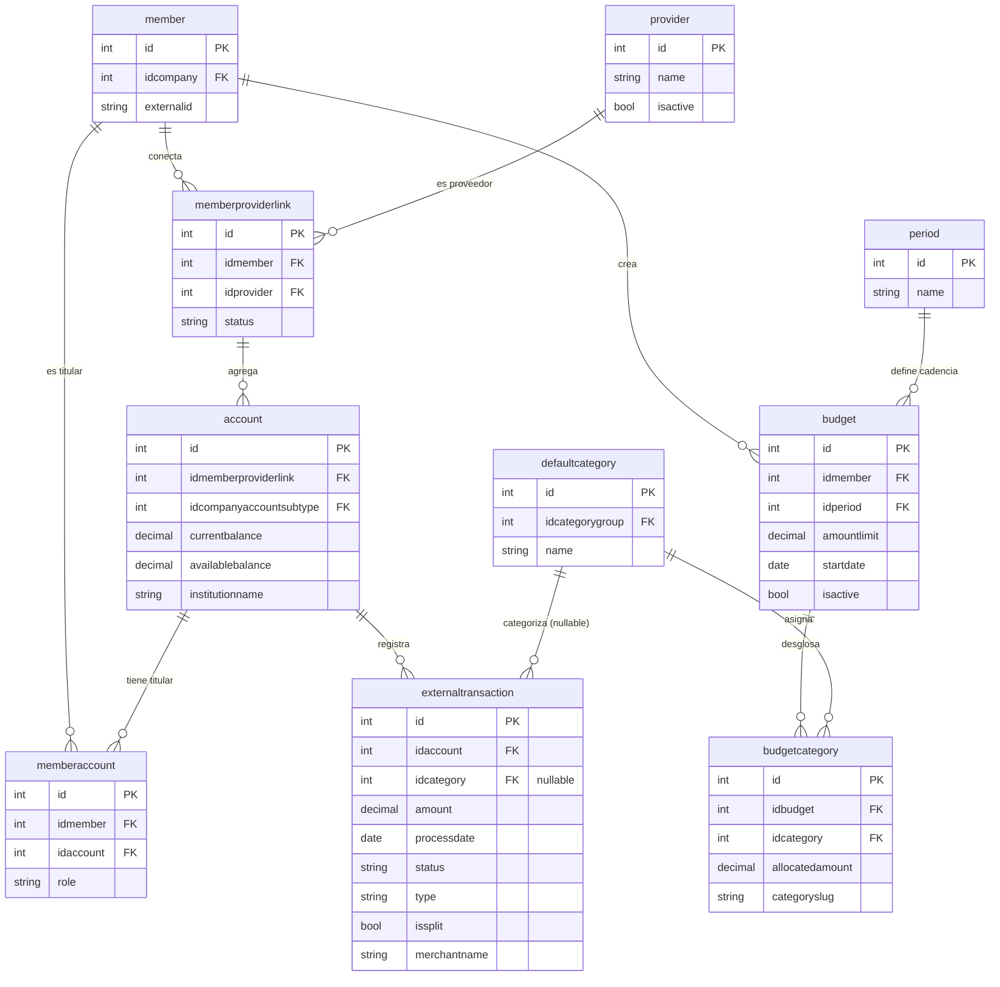

# Revisión de datos — Entorno **DEV**

**Fecha:** 2026-05-08
**Autor:** Landneyker (DS-ML)
**Alcance:** Revisión del snapshot del datalake **dev** disponible en `data/dough/dev/`.
**Documento padre:** [`data_review.md`](data_review.md) (índice multi-entorno).

---

## 1. Origen del snapshot

```
S3 bucket:    s3://blossom-analytics-datalake-dev/datalake/{bronze,silver}/DOUGH/
AWS profile:  blossom-dev
Path local:   data/dough/dev/{bronze,silver}/
```

Dev es **entorno de desarrollo activo** con tráfico de pruebas más rico que alpha. **Es el entorno primario para iterar Smart Budget hoy.**

---

## 2. Diferencias entre capas (dev)

| Capa | Estado | Filas vs. silver | Columnas vs. silver | Qué contiene |
|---|---|---|---|---|
| **bronze** | Activa (30 tablas) | Iguales en la mayoría | **+5 columnas** (`_dms_operation`, `_dms_timestamp`, `_ingested_at`, `_run_id`, `_load_type`) | Stream CDC crudo. |
| **silver** | Activa (30 tablas) | Estado actual | Solo columnas de negocio | Datos limpios. **Fuente de Smart Budget.** |
| **gold** | **Vacía** | — | — | Destino de los outputs DS-ML (a crear). |

> **Para Smart Budget en dev: usar silver.**

---

## 3. Volumen del entorno dev

| Tipo | Conteo dev |
|---|---|
| Clients | 2 |
| Companies (CUs) | 15 |
| Members | 21 |
| Member-account links | 3 |
| Member-provider links | 3 |
| Accounts externas | 5 |
| Manualaccounts | 51 |
| **Externaltransactions** | **15 (todas posted)** |
| Manualtransactions | 86 |
| Budgets | 2 |
| Budgetcategories | 4 |
| Periods | 1 (`monthly`) |
| Members con T&C aceptados | 60 aceptaciones / 16 T&C |
| Companyntropycategory mappings | 1.352 |

> Volumen pequeño pero **estructuralmente completo**: existen las tablas transaccionales que faltaban en alpha.

---

## 4. Tablas presentes en dev (silver, 30 tablas)

### 4.1 Tablas comunes con alpha (23)
Mismas que alpha pero con volumen mayor en varias (companies, members, manualaccount, manualtransaction, etc.). Ver dimensiones en §3.

### 4.2 Tablas **adicionales** que solo existen en dev (7) ⭐

#### `account` (5 filas)
**Propósito:** cuentas externas agregadas vía Plaid/Finicity.
**Columnas:** `id`, `idmemberproviderlink`, `name`, `currentbalance`, `availablebalance`, `externalid`, `blossomdoughconsolidatedaccountid`, `accountnumber`, `institutionname`, `routingnumber`, `logo`, `idcompanyaccountsubtype`, `metadata`, timestamps, `_last_cdc_timestamp`.
**Para Smart Budget:** define qué cuentas tiene el miembro. Filtrar por `idcompanyaccountsubtype` activo y combinar con `memberaccount` para llegar al miembro.

#### `externaltransaction` (15 filas) ⭐ **Tabla principal del modelo**
**Propósito:** transacciones reales provenientes de Plaid/Finicity.
**Columnas:** `id`, `idaccount`, `idcategory`, `externalid`, `blossomdoughconsolidatedtransactionid`, `amount`, `balance`, `processdate`, `effectivedate`, `status`, `type` (debit/credit), `description`, `merchantname`, `checknumber`, `issplit`, `metadata`, timestamps.
**Estado en el snapshot:** las 15 filas son `posted`. 12 debit, 3 credit. **Todas con `issplit = false` y `idcategory` vacío.**
**Para Smart Budget:**
- Es la fuente para el cálculo de la mediana (filtrar `status='posted'` y `type='debit'` para gasto).
- ⚠️ `idcategory` viene vacío en este snapshot — la categorización probablemente se aplica en runtime o vive en otra tabla aún no replicada.
- ⚠️ No hay registros con `issplit=true`, por lo que no podemos validar la lógica de splits con esta data.

#### `memberaccount` (3 filas)
**Propósito:** vínculo N:M entre `member` y `account`. Soporta cuentas conjuntas (un account → varios members con `role`).
**Columnas:** `id`, `idmember`, `idaccount`, `role`, timestamps.
**Para Smart Budget:** join obligatorio para llegar de `externaltransaction` a `member`.

#### `memberproviderlink` (3 filas)
**Propósito:** registra qué providers (Plaid/Finicity) tiene conectados cada miembro.
**Columnas:** `id`, `idmember`, `idprovider`, `provideruserid`, `provideraccesstoken`, `status` (active/inactive), `metadata`, timestamps.
**Para Smart Budget:** detectar miembros sin conexiones activas (no tienen data externa para sugerir).

#### `budget` (2 filas)
**Propósito:** presupuesto creado por el miembro. **Es donde Manual Budget guarda hoy y donde Smart Budget escribirá su salida confirmada.**
**Columnas:** `id`, `idmember`, `idperiod`, `name`, `amountlimit`, `startdate`, `enddate`, `isactive`, `alertthreshold`, timestamps, `_last_cdc_timestamp`.
**Para Smart Budget:** la tabla destino cuando el usuario confirma una sugerencia.

#### `budgetcategory` (4 filas)
**Propósito:** desglose por categoría dentro de un budget.
**Columnas:** `id`, `idbudget`, `idcategory`, `idcategorygroup`, `allocatedamount`, `categoryslug`, timestamps, `_last_cdc_timestamp`.
**Para Smart Budget:** extender con columnas opcionales (`suggested_amount`, `confidence`, `model_version`) o crear tabla paralela `smartBudgetSuggestion`.

#### `period` (1 fila)
**Propósito:** catálogo de periodicidades de presupuesto. Hoy solo `monthly`.
**Columnas:** `id`, `name`, `description`, `customday`, timestamps.
**Para Smart Budget:** Fase 0 solo soporta `monthly`. Otras periodicidades se evalúan en fases futuras.

---

## 5. Diagrama ER — capa transaccional disponible en dev



---

## 6. Path de joins para Smart Budget Fase 0 (dev)

Para llegar de `externaltransaction` a la unidad `member × category × month`:

```sql
SELECT
    ma.idmember,
    et.idcategory,                                  -- ⚠️ nullable hoy, ver hallazgos
    DATE_TRUNC('month', et.processdate) AS month,
    SUM(CASE WHEN et.type = 'debit'  THEN et.amount * -1
             WHEN et.type = 'credit' THEN et.amount
             ELSE 0 END) AS monthly_amount
FROM externaltransaction et
JOIN account a            ON a.id = et.idaccount
JOIN memberaccount ma     ON ma.idaccount = a.id
JOIN member m             ON m.id = ma.idmember
WHERE et.status = 'posted'
  AND et.type = 'debit'                              -- excluye credits del cálculo de gasto
  AND et.deletedat IS NULL
  -- AND ma.role <> 'authorized'                     -- TBD: ¿filtrar joints?
GROUP BY ma.idmember, et.idcategory, DATE_TRUNC('month', et.processdate);
```

> Importante: `idcategory` viene null en el snapshot. La categorización efectiva probablemente vive en otra capa (Ntropy enriquecido en runtime o tabla aún no replicada). Pendiente confirmar con Backend de Dough.

---

## 7. ⚠️ Hallazgos críticos para Smart Budget

### 7.1 `idcategory` viene vacío
Las 15 filas de `externaltransaction` tienen `idcategory = NULL`. Sin categorización **no se puede calcular Smart Budget**.

**Hipótesis:**
- La categorización Ntropy se aplica en runtime al servir al frontend, no se persiste.
- O vive en una tabla `userCategoryTransaction` aún no replicada al lake.

**Acción:** confirmar con Backend de Dough cómo se obtiene la categoría asignada a una transacción para análisis batch.

### 7.2 No existe tabla `transactionSplit`
El PRD habla de splits, pero la estructura actual usa **un flag `issplit` en `externaltransaction`** y todas las filas son `false`. Posibilidades:
- Los splits se guardan en otra tabla (no replicada aún).
- Los splits se modelan diferente (un mismo `externaltransaction` con N filas hijas, o columnas adicionales).

**Acción:** confirmar el modelo real de splits antes de codear el agregador.

### 7.3 `transaction` vs `externaltransaction`
En el PRD/docs aparece `transaction`. En la BD aparece **`externaltransaction`** y separadamente `manualtransaction`. **No existe una tabla unificada.**
**Acción:** Smart Budget Fase 0 puede empezar solo con `externaltransaction` (transacciones posteadas de Plaid/Finicity, que es el caso de uso real del modelo).

### 7.4 `category` (custom por usuario) no existe
Solo hay `defaultcategory` (catálogo global). El PRD menciona categorías personalizadas por usuario.
**Acción:** confirmar si las custom existen en la BD operativa o si la doc anticipaba algo no implementado.

### 7.5 Volumen muy bajo
15 transacciones, 21 members, 5 accounts. Es **insuficiente** para validar el modelo a fondo.
**Acción:** generar dataset sintético adicional o solicitar acceso de read-only al datalake prod cuando esté disponible.

---

## 8. Comandos para refrescar el snapshot de dev

```bash
python scripts/extract_dough_to_csv.py --env dev
```

---

## 9. Próximos pasos para dev

1. **Resolver §7.1:** confirmar dónde vive `idcategory` para externaltransaction (runtime o tabla pendiente de replicar).
2. **Resolver §7.2:** confirmar cómo se modelan los splits en la BD operativa.
3. **Crear capa gold inicial:** `dbt/models/marts/smart_budget/` con el agregado mensual `member × category × month`.
4. **Tabla destino:** decidir entre extender `budgetcategory` con columnas DS-ML o crear `smartBudgetSuggestion` separada.
5. **Generar dataset sintético** para tests unitarios (50–100 members con histórico de 6+ meses) — el volumen actual de dev no alcanza.
